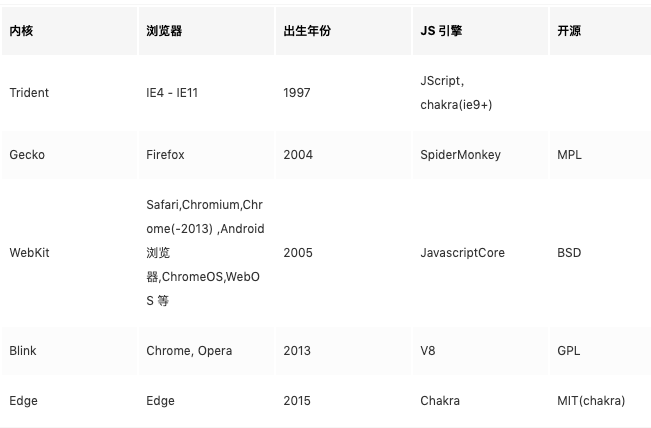
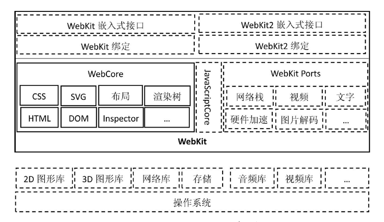
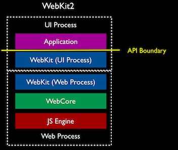
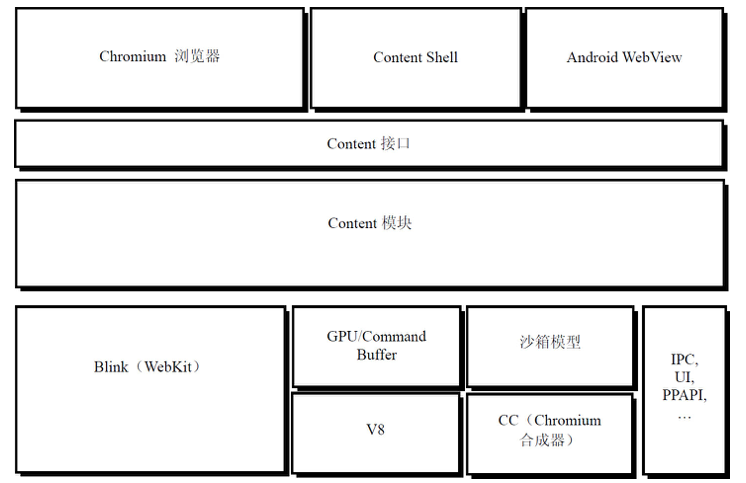
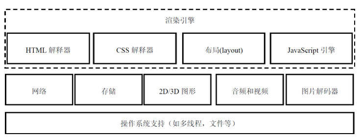
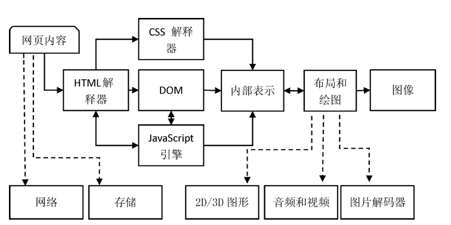
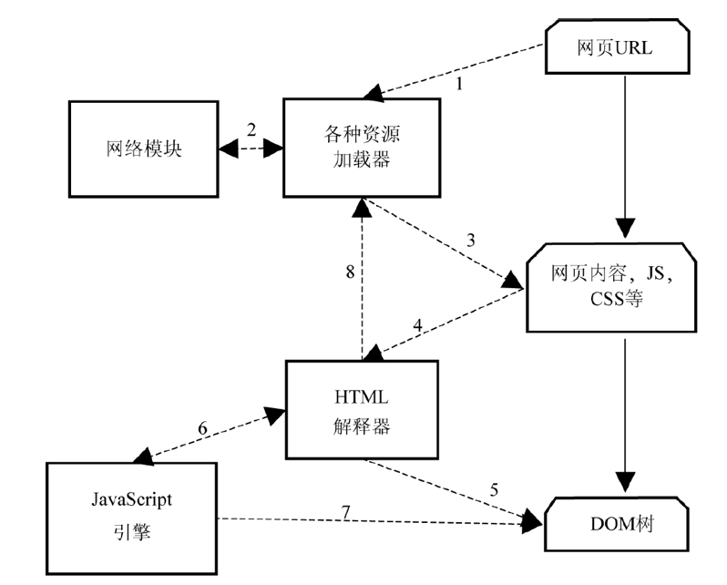
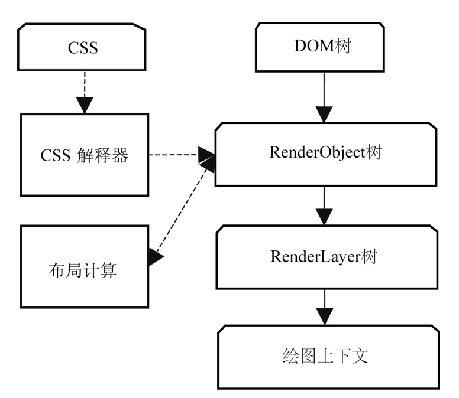

#### 渲染引擎

##### User-Agent

* 用户代理，简称UA，用于识别用户的当前环境，浏览器及版本号、操作系统等信息；
* User-Agent也是用户识别的重要部分，通过分析，能知道用户使用的是什么设备、什么浏览器、什么应用等；

"Mozilla/5.0 (Macintosh; Intel Mac OS X 10_14_5) AppleWebKit/537.36 (KHTML, like Gecko) Chrome/78.0.3904.108 Safari/537.36"

1. Mozilla/5.0 ：以前用于Netscape浏览器，目前大多数浏览器UA都会带有；
2. Macintosh; Intel Mac OS X 10_14_5 ：当前笔记本系统版本等；
3. AppleWebKit： webkit版本；
4. KHTML：一个HTML排版引擎；
5. like Gecko：这不是Geckeo 浏览器，但是运行起来像Geckeo浏览器；
6. Chrome/78.0.3904.108：谷歌浏览器版本号；
7. Safari/537.36：兼容safari的意思吧；

##### 浏览器的历史

* WorldWideWeb 1991 年 同时也是一个编辑器
* Mosaic 1993年
* Netscape 1994年
* Opera 1995年
* IE 1995年 第一次浏览器大战
* Safari 2003年
* Firefox 2004年 第二次浏览器大战
* Chrome 2008年
* Edge  2015年

    

> 特别说明：在 2008年，Google 发布 Chrome 浏览器，采用的也是 Webkit 内核，同时技术团队人员也参与 WebKit 项目的开发，但是在设计上与 Apple 团队存在分歧，所以 Google 的人就独立出来，基于 WebKit 开发了 Blink 内核，Blink 在 Webkit 的基础上加入多进程，沙箱等很多技术。

##### webKit架构

* 上图中实线部分，也就是 WebCore，基本上在各个浏览器中是共享的，虚线部分在各个浏览器中的存在差异；
* WebCore 是渲染引擎，包含的 HTML 解释器，CSS 解释器，处理页面布局渲染等功能；
* JavascriptCore 就是 WebKit 内置的 Javascript 引擎；
* WebKit 2 是 2010年4月份发布的，抽象出一组新的编程接口，给开发者用，同时采用了多进程：，一个UI 进程，处理Web平台与浏览器接口的进程，另外一个 Web 进程, Web 页面渲染的进程。 让 web 进程与 UI 进程隔离，在健壮性、安全性以及更好地使用多核 cpu 等方面带来了好处。 

    

* WebKit Port，并没有确切的形式，可以看作是OS，平台（应用程序框架），Javacsript 引擎，以及各种第三方库的一个组合。WebKit Port 提供不同的 Port 接口供外部程序使用；

##### chrome浏览器

与webkit内核平级的有：

* GPU/Command Buffer ,   Command Buffer 是 GPU 线程的通信媒介，提供GPU 硬件加速。
* V8，Javascript 引擎
* 沙箱模型，浏览器安全保护的一种设计
* CC（Chromium 合成器），对 RenderLayer Tree 分成渲染
* IPC,UI,PPAPI ...

> 特别解释：Content , 如果没有 Content， 也能正常渲染，不过上面提到的这些GPU 加速，沙箱模型，HTML 5等功能将没有，Content API 提供了公开稳定的接口， 目标是支持所有的 HTML5功能和GPU硬件加速等功能。

“Chromium浏览器” 和 “ContentShell” 是构建在 ContentAPI 之上的两个“浏览器”：

* “Chromium浏览器”：具有完整浏览器功能，编译出完整浏览器样式；
* “ContentShell”是使用ContentAPI来包装的一层简单的“壳”，但是它也是一个简单的“浏览器”；

ContentShell的作用：

1. 可以用来测试Content模块很多功能的正确性，例如渲染、硬件加速等；
2. 是一个参考，可以被很多外部的项目参考来开发基于“ContentAPI”的浏览器或者各种类型的项目；

* “Android WebView”，它是为了满足Android系统上的 WebView 而设计的，其思想是利用Chromium的实现来替换原来Android系统默认的 WebView。

##### 渲染过程

* 主要包括：HTML解释器、CSS解释器、布局和JavaScript引擎等，JavaScript引擎现在都已经独立出来；
* 依赖的模块，包括网络，存储，2D/3D 图形，音频和视频，图片解码器等等, 再下面就是操作系统相关的支持；

渲染及依赖模块关系：

在 WebKit 的渲染的详细过程：

> 简单解析：浏览器输入 URL 以后，依赖网络模块加载各种资源，得到一个HTML , HTML 交给 HTML 解析器进行解析，最后生成 DOM 树，如果再解析过程中有存在 Javascript 代码就交给 Javascript 引擎处理，处理完成返回给 DOM 树， 这个环节的主要目的就是构建一个DOM 树。

> 简单解析：网络资源中获得 CSS 代码以后，会把 CSS 交给 CSS 解析器处理，同时会计算布局。 DOM 树会构建成一个 RenderObject 树，它和 DOM 树节点是一一对应，然后再和 解析后的CSS 合并分析，生成 RenderLayer 树， 这个树就是最终用于渲染的树，然后绘制上下文。
